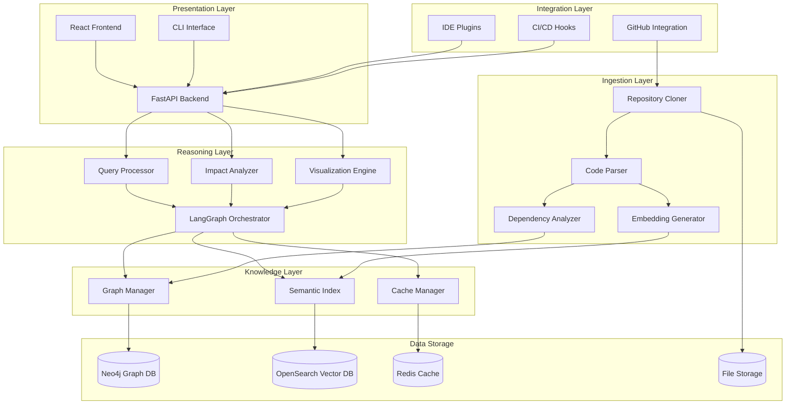

# Design Document: ATLAS Codebase Understanding System

## Overview

ATLAS is a sophisticated AI-powered system that transforms how developers interact with and understand complex codebases. The system combines multiple AI techniques including Abstract Syntax Tree (AST) parsing, graph databases, semantic embeddings, and large language models to create a comprehensive understanding of code structure, semantics, and relationships.

The architecture follows a layered approach with clear separation of concerns:

- **Ingestion Layer**: Handles repository cloning, parsing, and initial analysis
- **Knowledge Layer**: Stores and manages both structural (graph) and semantic (vector) representations
- **Reasoning Layer**: Processes natural language queries and orchestrates multi-step analysis
- **Presentation Layer**: Provides APIs and user interfaces for interaction
- **Integration Layer**: Connects with external services and development tools

The system is designed to handle enterprise-scale codebases while maintaining sub-5-second query response times and supporting multiple programming languages and frameworks.

## Architecture

### System Architecture Diagram



### Component Responsibilities

#### Presentation Layer
- **React Frontend**: Interactive web interface for repository management and querying
- **FastAPI Backend**: RESTful API server handling HTTP requests and orchestrating services
- **CLI Interface**: Command-line tool for batch operations and CI/CD integration

#### Integration Layer
- **GitHub Integration**: OAuth authentication and repository access management
- **IDE Plugins**: Extensions for VS Code, IntelliJ, and other popular IDEs
- **CI/CD Hooks**: Automated analysis triggers for continuous integration pipelines

#### Reasoning Layer
- **Query Processor**: Natural language understanding and query intent classification
- **Impact Analyzer**: Change impact assessment and dependency tracing
- **Visualization Engine**: Diagram generation and interactive visualization creation
- **LangGraph Orchestrator**: Multi-step reasoning workflow coordination

#### Knowledge Layer
- **Graph Manager**: Neo4j operations and graph query optimization
- **Semantic Index**: Vector similarity search and embedding management
- **Cache Manager**: Redis-based caching for frequent queries and results

#### Ingestion Layer
- **Repository Cloner**: Git operations and repository management
- **Code Parser**: AST parsing using Tree-sitter for multiple languages
- **Dependency Analyzer**: Import/export relationship extraction and analysis
- **Embedding Generator**: Semantic embedding creation using transformer models

## Components and Interfaces

### 1. Repository Cloner

**Purpose**: Manages Git repository operations and file system access.

**Interface**:
```python
class RepositoryCloner:
    def clone_repository(self, github_url: str, branch: str = "main") -> str
    def update_repository(self, repo_id: str) -> bool
    def get_repository_info(self, repo_id: str) -> RepositoryInfo
    def list_files(self, repo_id: str, extensions: List[str] = None) -> List[str]
    def cleanup_repository(self, repo_id: str) -> bool
```

**Key Features**:
- Supports both public and private repositories via GitHub tokens
- Incremental updates for existing repositories
- File filtering by extension and gitignore rules
- Automatic cleanup of temporary files

### 2. Code Parser

**Purpose**: Extracts structural information from source code using AST analysis.

**Interface**:
```python
class CodeParser:
    def parse_file(self, file_path: str, language: str) -> ParseResult
    def extract_functions(self, ast_node: Node) -> List[FunctionInfo]
    def extract_classes(self, ast_node: Node) -> List[ClassInfo]
    def extract_imports(self, ast_node: Node) -> List[ImportInfo]
    def get_supported_languages(self) -> List[str]
```

**Supported Languages**:
- Python, JavaScript/TypeScript, Java, C#, Go, Rust
- Configuration files: JSON, YAML, TOML, XML
- Build files: Dockerfile, Makefile, package.json, requirements.txt

### 3. Graph Manager

**Purpose**: Manages Neo4j graph database operations for structural relationships.

**Interface**:
```python
class GraphManager:
    def create_repository_graph(self, repo_info: RepositoryInfo) -> str
    def add_file_node(self, file_info: FileInfo, repo_id: str) -> str
    def add_function_node(self, func_info: FunctionInfo, file_id: str) -> str
    def create_dependency_edge(self, from_node: str, to_node: str, dep_type: str)
    def query_dependencies(self, node_id: str, depth: int = 3) -> List[Dependency]
    def find_similar_functions(self, function_signature: str) -> List[FunctionMatch]
```

**Graph Schema**:
```cypher
// Core node types
(:Repository {id, name, url, language_stats, created_at})
(:File {path, language, size, hash, last_modified})
(:Function {name, signature, line_start, line_end, complexity})
(:Class {name, line_start, line_end, methods_count})
(:Variable {name, type, scope})

// Relationship types
(:Repository)-[:CONTAINS]->(:File)
(:File)-[:DEFINES]->(:Function|:Class)
(:Function)-[:CALLS]->(:Function)
(:File)-[:IMPORTS]->(:File)
(:Class)-[:INHERITS]->(:Class)
(:Function)-[:USES]->(:Variable)
```

### 4. Semantic Index

**Purpose**: Manages vector embeddings for semantic code search.

**Interface**:
```python
class SemanticIndex:
    def generate_embeddings(self, code_snippets: List[str]) -> List[Vector]
    def index_function(self, func_info: FunctionInfo, embedding: Vector)
    def semantic_search(self, query: str, limit: int = 10) -> List[SearchResult]
    def find_similar_code(self, code_snippet: str) -> List[SimilarityMatch]
    def update_embeddings(self, updated_functions: List[str])
```

**Embedding Strategy**:
- Function-level embeddings using CodeBERT or similar models
- Docstring and comment embeddings for semantic understanding
- Cross-language semantic similarity detection
- Incremental updates for changed code

### 5. Query Processor

**Purpose**: Processes natural language queries using LangGraph workflows.

**Interface**:
```python
class QueryProcessor:
    def process_query(self, question: str, repo_id: str) -> QueryResult
    def classify_intent(self, question: str) -> QueryIntent
    def generate_graph_queries(self, intent: QueryIntent) -> List[str]
    def combine_results(self, graph_results: List, semantic_results: List) -> Context
    def generate_response(self, context: Context, question: str) -> str
```

**Query Types**:
- **Location**: "Where is the authentication logic?"
- **Explanation**: "How does the payment processing work?"
- **Impact**: "What would break if I change this function?"
- **Dependency**: "What files depend on this module?"
- **Pattern**: "Show me all error handling patterns"

### 6. Impact Analyzer

**Purpose**: Analyzes the impact of proposed code changes.

**Interface**:
```python
class ImpactAnalyzer:
    def analyze_function_change(self, function_id: str) -> ImpactReport
    def analyze_file_change(self, file_path: str) -> ImpactReport
    def trace_dependencies(self, node_id: str, direction: str) -> DependencyTree
    def calculate_risk_score(self, changes: List[Change]) -> float
    def suggest_test_coverage(self, impact: ImpactReport) -> List[TestSuggestion]
```

**Impact Categories**:
- **Breaking Changes**: API signature modifications
- **Behavioral Changes**: Logic modifications that affect output
- **Performance Impact**: Changes affecting system performance
- **Security Impact**: Changes affecting security boundaries

### 7. Visualization Engine

**Purpose**: Generates interactive diagrams and visualizations.

**Interface**:
```python
class VisualizationEngine:
    def generate_architecture_diagram(self, repo_id: str) -> DiagramData
    def create_dependency_graph(self, focus_node: str, depth: int) -> GraphData
    def generate_flow_diagram(self, entry_point: str) -> FlowData
    def create_impact_visualization(self, impact_report: ImpactReport) -> ImpactViz
    def export_diagram(self, diagram_data: DiagramData, format: str) -> bytes
```

**Visualization Types**:
- **Architecture Diagrams**: High-level system structure
- **Dependency Graphs**: File and function relationships
- **Flow Diagrams**: Execution path visualization
- **Impact Maps**: Change propagation visualization

## Data Models

### Core Data Structures

```python
@dataclass
class RepositoryInfo:
    id: str
    name: str
    github_url: str
    branch: str
    local_path: str
    language_stats: Dict[str, int]
    total_files: int
    total_lines: int
    created_at: datetime
    last_analyzed: datetime

@dataclass
class FileInfo:
    path: str
    language: str
    size: int
    hash: str
    functions: List[FunctionInfo]
    classes: List[ClassInfo]
    imports: List[ImportInfo]
    last_modified: datetime

@dataclass
class FunctionInfo:
    name: str
    signature: str
    line_start: int
    line_end: int
    parameters: List[Parameter]
    return_type: Optional[str]
    docstring: Optional[str]
    complexity: int
    calls: List[str]

@dataclass
class QueryResult:
    question: str
    answer: str
    confidence: float
    sources: List[SourceReference]
    intent: QueryIntent
    execution_time: float
    graph_results: List[Dict]
    semantic_results: List[Dict]

@dataclass
class ImpactReport:
    target_element: str
    affected_files: List[str]
    affected_functions: List[str]
    risk_level: RiskLevel
    change_categories: List[ChangeCategory]
    test_suggestions: List[TestSuggestion]
    confidence_score: float
```

### Database Schemas

#### Neo4j Graph Schema
```cypher
// Constraints
CREATE CONSTRAINT repo_id IF NOT EXISTS FOR (r:Repository) REQUIRE r.id IS UNIQUE;
CREATE CONSTRAINT file_path IF NOT EXISTS FOR (f:File) REQUIRE (f.repo_id, f.path) IS UNIQUE;
CREATE CONSTRAINT func_signature IF NOT EXISTS FOR (fn:Function) REQUIRE (fn.file_id, fn.signature) IS UNIQUE;

// Indexes
CREATE INDEX file_language IF NOT EXISTS FOR (f:File) ON (f.language);
CREATE INDEX func_name IF NOT EXISTS FOR (fn:Function) ON (fn.name);
CREATE INDEX dependency_type IF NOT EXISTS FOR ()-[r:DEPENDS_ON]-() ON (r.type);
```

#### OpenSearch Index Schema
```json
{
  "mappings": {
    "properties": {
      "repository_id": {"type": "keyword"},
      "file_path": {"type": "keyword"},
      "function_name": {"type": "text"},
      "function_signature": {"type": "text"},
      "docstring": {"type": "text"},
      "code_snippet": {"type": "text"},
      "language": {"type": "keyword"},
      "embedding": {
        "type": "dense_vector",
        "dims": 768
      },
      "created_at": {"type": "date"}
    }
  }
}
```

## Technology Stack

### Backend Services
- **API Framework**: FastAPI with async support
- **Graph Database**: Neo4j 5.x with APOC plugins
- **Vector Database**: OpenSearch with k-NN plugin
- **Cache**: Redis 7.x with clustering support
- **Message Queue**: Celery with Redis broker
- **Authentication**: OAuth 2.0 with GitHub integration

### AI/ML Components
- **Code Parsing**: Tree-sitter with language grammars
- **Embeddings**: CodeBERT, GraphCodeBERT, or similar transformer models
- **LLM Integration**: OpenAI GPT-4 or Anthropic Claude via API
- **Workflow Orchestration**: LangGraph for multi-step reasoning
- **Vector Search**: FAISS or OpenSearch k-NN

### Frontend Technologies
- **Framework**: React 18 with TypeScript
- **UI Library**: Material-UI (MUI) v5
- **State Management**: Redux Toolkit with RTK Query
- **Visualization**: D3.js, Cytoscape.js for graph rendering
- **Code Highlighting**: Monaco Editor (VS Code editor)

### Infrastructure
- **Containerization**: Docker with multi-stage builds
- **Orchestration**: Kubernetes or Docker Compose
- **Load Balancing**: NGINX or Traefik
- **Monitoring**: Prometheus + Grafana
- **Logging**: ELK Stack (Elasticsearch, Logstash, Kibana)

### Development Tools
- **Language**: Python 3.11+ with type hints
- **Testing**: pytest, pytest-asyncio, testcontainers
- **Code Quality**: black, isort, flake8, mypy
- **Documentation**: Sphinx with autodoc
- **CI/CD**: GitHub Actions or GitLab CI

## API Design

### REST API Endpoints

#### Repository Management
```http
POST /api/v1/repositories
Content-Type: application/json
{
  "github_url": "https://github.com/user/repo",
  "branch": "main",
  "access_token": "optional_for_private_repos"
}

GET /api/v1/repositories/{repo_id}
GET /api/v1/repositories/{repo_id}/status
DELETE /api/v1/repositories/{repo_id}
PUT /api/v1/repositories/{repo_id}/refresh
```

#### Query Interface
```http
POST /api/v1/repositories/{repo_id}/query
Content-Type: application/json
{
  "question": "Where is the user authentication handled?",
  "context": "optional_additional_context",
  "include_sources": true
}

GET /api/v1/repositories/{repo_id}/queries
GET /api/v1/repositories/{repo_id}/queries/{query_id}
```

#### Impact Analysis
```http
POST /api/v1/repositories/{repo_id}/impact-analysis
Content-Type: application/json
{
  "target_type": "function|file|class",
  "target_identifier": "path/to/file.py:function_name",
  "change_type": "modify|delete|rename"
}
```

#### Visualization
```http
GET /api/v1/repositories/{repo_id}/visualizations/architecture
GET /api/v1/repositories/{repo_id}/visualizations/dependencies?focus={node_id}&depth={depth}
POST /api/v1/repositories/{repo_id}/visualizations/flow
Content-Type: application/json
{
  "entry_point": "main.py:main",
  "max_depth": 5
}
```

### WebSocket API for Real-time Updates

```javascript
// Connection
const ws = new WebSocket('ws://api.atlas.dev/ws/repositories/{repo_id}');

// Analysis progress updates
ws.onmessage = (event) => {
  const update = JSON.parse(event.data);
  switch(update.type) {
    case 'analysis_progress':
      updateProgressBar(update.progress);
      break;
    case 'analysis_complete':
      showAnalysisResults(update.results);
      break;
    case 'error':
      showError(update.message);
      break;
  }
};
```

## Integration Patterns

### GitHub Integration

**OAuth Flow**:
1. User initiates GitHub connection
2. Redirect to GitHub OAuth with required scopes
3. Store access token securely with encryption
4. Use token for repository access and webhook setup

**Webhook Integration**:
```python
@app.post("/webhooks/github")
async def github_webhook(request: Request):
    payload = await request.json()
    
    if payload["action"] in ["push", "pull_request"]:
        repo_id = get_repo_id_from_url(payload["repository"]["html_url"])
        if repo_id:
            # Queue incremental analysis
            celery_app.send_task("analyze_changes", args=[repo_id, payload])
    
    return {"status": "received"}
```

### IDE Plugin Architecture

**VS Code Extension**:
```typescript
// Extension activation
export function activate(context: vscode.ExtensionContext) {
    const provider = new AtlasCodeLensProvider();
    vscode.languages.registerCodeLensProvider('*', provider);
    
    // Register commands
    vscode.commands.registerCommand('atlas.explainFunction', explainFunction);
    vscode.commands.registerCommand('atlas.findUsages', findUsages);
    vscode.commands.registerCommand('atlas.analyzeImpact', analyzeImpact);
}

// Code lens provider for inline insights
class AtlasCodeLensProvider implements vscode.CodeLensProvider {
    provideCodeLenses(document: vscode.TextDocument): vscode.CodeLens[] {
        const lenses: vscode.CodeLens[] = [];
        
        // Add code lenses for functions
        const functions = parseFunctions(document.getText());
        functions.forEach(func => {
            lenses.push(new vscode.CodeLens(func.range, {
                title: "🔍 Explain with ATLAS",
                command: "atlas.explainFunction",
                arguments: [func.name, document.uri.fsPath]
            }));
        });
        
        return lenses;
    }
}
```

### CI/CD Integration

**GitHub Actions Workflow**:
```yaml
name: ATLAS Code Analysis
on:
  pull_request:
    branches: [main]

jobs:
  atlas-analysis:
    runs-on: ubuntu-latest
    steps:
      - uses: actions/checkout@v3
      
      - name: Run ATLAS Impact Analysis
        uses: atlas-ai/github-action@v1
        with:
          atlas-api-key: ${{ secrets.ATLAS_API_KEY }}
          repository-id: ${{ secrets.ATLAS_REPO_ID }}
          analysis-type: "impact"
          
      - name: Comment PR with Results
        uses: actions/github-script@v6
        with:
          script: |
            const results = require('./atlas-results.json');
            const comment = `## 🔍 ATLAS Impact Analysis
            
            **Risk Level**: ${results.risk_level}
            **Affected Files**: ${results.affected_files.length}
            
            ### Key Impacts:
            ${results.impacts.map(i => `- ${i.description}`).join('\n')}
            `;
            
            github.rest.issues.createComment({
              issue_number: context.issue.number,
              owner: context.repo.owner,
              repo: context.repo.repo,
              body: comment
            });
```

## Error Handling

### Error Categories and Responses

**Repository Access Errors**:
```python
class RepositoryAccessError(Exception):
    """Raised when repository cannot be accessed or cloned"""
    
    def __init__(self, repo_url: str, reason: str):
        self.repo_url = repo_url
        self.reason = reason
        super().__init__(f"Cannot access repository {repo_url}: {reason}")

# Error response format
{
    "error": {
        "type": "repository_access_error",
        "message": "Repository not found or access denied",
        "details": {
            "repository_url": "https://github.com/user/private-repo",
            "suggestion": "Ensure repository exists and access token has required permissions"
        },
        "retry_after": 300
    }
}
```

**Parsing Errors**:
```python
class CodeParsingError(Exception):
    """Raised when code cannot be parsed"""
    
    def __init__(self, file_path: str, language: str, line_number: int = None):
        self.file_path = file_path
        self.language = language
        self.line_number = line_number

# Graceful degradation for parsing errors
async def parse_file_safely(file_path: str) -> ParseResult:
    try:
        return await code_parser.parse_file(file_path)
    except CodeParsingError as e:
        logger.warning(f"Failed to parse {file_path}: {e}")
        return ParseResult(
            file_path=file_path,
            success=False,
            error=str(e),
            partial_data=extract_basic_info(file_path)
        )
```

**Query Processing Errors**:
```python
class QueryProcessingError(Exception):
    """Raised when query cannot be processed"""
    
    def __init__(self, query: str, stage: str, reason: str):
        self.query = query
        self.stage = stage
        self.reason = reason

# Fallback responses for query errors
async def process_query_with_fallback(query: str, repo_id: str) -> QueryResult:
    try:
        return await query_processor.process_query(query, repo_id)
    except QueryProcessingError as e:
        return QueryResult(
            question=query,
            answer=f"I encountered an issue processing your query: {e.reason}. "
                   f"Please try rephrasing your question or contact support.",
            confidence=0.0,
            sources=[],
            error=str(e)
        )
```

### Circuit Breaker Pattern

```python
from circuit_breaker import CircuitBreaker

# Protect external API calls
llm_circuit_breaker = CircuitBreaker(
    failure_threshold=5,
    recovery_timeout=60,
    expected_exception=LLMAPIError
)

@llm_circuit_breaker
async def call_llm_api(prompt: str) -> str:
    """Call LLM API with circuit breaker protection"""
    response = await llm_client.generate(prompt)
    return response.text
```

## Testing Strategy

### Testing Approach

ATLAS employs a comprehensive testing strategy combining unit tests for specific functionality and property-based tests for universal correctness properties. This dual approach ensures both concrete bug detection and general system reliability.

#### Unit Testing Focus Areas
- **API endpoint validation**: Test specific request/response patterns
- **Error handling**: Verify proper error responses and recovery
- **Integration points**: Test connections between components
- **Edge cases**: Handle malformed inputs and boundary conditions

#### Property-Based Testing Focus Areas
- **Data consistency**: Verify graph and vector store synchronization
- **Query correctness**: Ensure query results match expected patterns
- **Parsing reliability**: Validate AST parsing across diverse codebases
- **Performance invariants**: Maintain response time guarantees

### Testing Configuration

**Property-Based Test Setup**:
- **Library**: Hypothesis for Python, fast-check for TypeScript
- **Iterations**: Minimum 100 iterations per property test
- **Shrinking**: Automatic test case minimization on failure
- **Seeding**: Reproducible test runs with fixed seeds

**Test Tagging Format**:
Each property test must include a comment referencing its design document property:
```python
# Feature: atlas-codebase-understanding, Property 1: Repository ingestion preserves file structure
def test_repository_ingestion_preserves_structure(repo_data):
    # Property test implementation
```

Now I need to use the prework tool to analyze the acceptance criteria before writing the correctness properties section.

<function_calls>
<invoke name="prework">
<parameter name="featureName">atlas-codebase-understanding
## Correctness Properties

*A property is a characteristic or behavior that should hold true across all valid executions of a system—essentially, a formal statement about what the system should do. Properties serve as the bridge between human-readable specifications and machine-verifiable correctness guarantees.*

Based on the prework analysis of acceptance criteria, the following correctness properties have been identified for property-based testing. These properties ensure universal correctness across all valid inputs and system states.

### Property 1: Repository Ingestion Completeness
*For any* valid repository (GitHub URL or archive), when ATLAS processes it, all supported file types should be parsed and indexed, with a complete code graph containing all expected relationships and semantic embeddings for all code elements.
**Validates: Requirements 1.1, 1.2, 1.3, 1.4, 1.5**

### Property 2: Repository Access Error Handling
*For any* invalid or inaccessible repository input, ATLAS should return clear error messages with specific resolution steps and appropriate error codes.
**Validates: Requirements 1.6**

### Property 3: Query Intent Classification
*For any* natural language query, the Query Processor should classify it into a valid intent category and trigger appropriate search mechanisms (graph, semantic, or both).
**Validates: Requirements 2.1, 2.2**

### Property 4: Query Response Format Consistency
*For any* query response, ATLAS should provide specific file locations, code snippets, and proper citations with files, functions, and line numbers.
**Validates: Requirements 2.3, 2.6**

### Property 5: Result Ranking and Relevance
*For any* query with multiple results, ATLAS should rank them by relevance scores in descending order and provide appropriate confidence indicators.
**Validates: Requirements 2.4, 6.2**

### Property 6: Low Confidence Query Handling
*For any* query that cannot be answered with high confidence, ATLAS should indicate uncertainty and provide alternative query suggestions.
**Validates: Requirements 2.5**

### Property 7: Impact Analysis Completeness
*For any* specified code element, the Impact Analyzer should identify all direct and transitive dependencies, categorize them by impact type, and provide confidence scores for each dependency.
**Validates: Requirements 3.1, 3.2, 3.3, 3.4**

### Property 8: Risk Assessment Accuracy
*For any* change affecting critical system components, ATLAS should flag it as high-risk, while isolated changes should be confirmed as having no impact.
**Validates: Requirements 3.5, 3.6**

### Property 9: Visualization Structure Integrity
*For any* generated diagram, it should maintain hierarchical organization, include both internal and external relationships, and support all required export formats (SVG, PNG, PDF).
**Validates: Requirements 4.1, 4.2, 4.6**

### Property 10: Flow Diagram Completeness
*For any* execution entry point, flow diagrams should trace all possible execution paths through the system up to the specified depth.
**Validates: Requirements 4.3**

### Property 11: Documentation Content Completeness
*For any* generated documentation, it should include structured architectural overviews, component explanations with purpose and interactions, identified design patterns, and both high-level and detailed technical explanations.
**Validates: Requirements 5.1, 5.2, 5.3, 5.4, 5.6**

### Property 12: Search Mode Support
*For any* search request, ATLAS should support both semantic and syntactic search modes and provide adequate surrounding context for code matches.
**Validates: Requirements 6.1, 6.3**

### Property 13: Comparative Analysis Provision
*For any* search yielding multiple implementations, ATLAS should provide comparisons between different approaches, while empty results should include helpful suggestions.
**Validates: Requirements 6.4, 6.5**

### Property 14: Cross-Reference Navigation
*For any* search result, ATLAS should provide cross-references to related code elements for navigation.
**Validates: Requirements 6.6**

### Property 15: Multi-Language Support Coverage
*For any* repository containing supported languages (Python, JavaScript, Java, C#, Go, Rust), ATLAS should properly process all files and recognize framework patterns.
**Validates: Requirements 7.1, 7.2**

### Property 16: Configuration and Cross-Language Handling
*For any* repository with configuration files or mixed languages, ATLAS should parse configurations and track cross-language dependencies while applying appropriate language-specific techniques.
**Validates: Requirements 7.3, 7.4, 7.5**

### Property 17: Unsupported File Graceful Handling
*For any* repository containing unsupported file types, ATLAS should skip them gracefully and report accurate coverage statistics.
**Validates: Requirements 7.6**

### Property 18: Performance Bounds Compliance
*For any* repository under 100k LOC, analysis should complete within 30 minutes, and any query should respond within 5 seconds, while maintaining performance under concurrent access.
**Validates: Requirements 8.1, 8.2, 8.3**

### Property 19: Resource Management Efficiency
*For any* system approaching memory or storage limits, ATLAS should implement appropriate caching, cleanup, compression, and optimization strategies.
**Validates: Requirements 8.4, 8.5**

### Property 20: Load Management and Prioritization
*For any* high system load scenario, ATLAS should properly queue and prioritize requests to maintain system stability.
**Validates: Requirements 8.6**

### Property 21: Security Boundary Enforcement
*For any* repository processing, all data should remain within designated security boundaries with proper encryption at rest and in transit.
**Validates: Requirements 9.1, 9.2**

### Property 22: Access Control Implementation
*For any* user access attempt, ATLAS should enforce appropriate authentication and authorization mechanisms.
**Validates: Requirements 9.3**

### Property 23: Data Lifecycle Management
*For any* completed analysis, ATLAS should provide functional data retention and deletion options while maintaining audit trails for security events.
**Validates: Requirements 9.4, 9.6**

### Property 24: Privacy Control Implementation
*For any* external service interaction, ATLAS should minimize data exposure and implement appropriate privacy controls.
**Validates: Requirements 9.5**

### Property 25: Integration Functionality
*For any* IDE, CI/CD, or API integration, ATLAS should provide functional plugins, automated analysis capabilities, and proper API support.
**Validates: Requirements 10.1, 10.2, 10.3**

### Property 26: Version Control and Collaboration
*For any* version control interaction, ATLAS should track changes and maintain historical understanding while supporting sharing of insights and annotations between team members.
**Validates: Requirements 10.4, 10.5**

### Property 27: Configuration Flexibility
*For any* customization request, ATLAS should allow proper configuration of analysis parameters and user preferences.
**Validates: Requirements 10.6**

## Testing Strategy

ATLAS employs a comprehensive dual testing approach that combines unit tests for specific scenarios with property-based tests for universal correctness guarantees.

### Unit Testing Strategy

**Focus Areas**:
- **API Endpoint Validation**: Test specific request/response patterns and error conditions
- **Component Integration**: Verify proper interaction between system components
- **Edge Case Handling**: Test boundary conditions and malformed inputs
- **Error Recovery**: Validate graceful degradation and recovery mechanisms

**Key Unit Test Categories**:
```python
# API endpoint tests
def test_repository_analysis_endpoint_with_valid_github_url()
def test_repository_analysis_endpoint_with_invalid_url()
def test_query_endpoint_with_missing_parameters()

# Component integration tests  
def test_graph_manager_semantic_index_synchronization()
def test_query_processor_impact_analyzer_coordination()

# Error handling tests
def test_parsing_error_graceful_degradation()
def test_database_connection_failure_recovery()
```

### Property-Based Testing Strategy

**Configuration**:
- **Library**: Hypothesis for Python components
- **Iterations**: Minimum 100 iterations per property test
- **Shrinking**: Automatic minimization of failing test cases
- **Seeding**: Reproducible test runs with fixed random seeds

**Property Test Implementation**:
Each correctness property must be implemented as a property-based test with proper tagging:

```python
from hypothesis import given, strategies as st

# Feature: atlas-codebase-understanding, Property 1: Repository Ingestion Completeness
@given(st.one_of(
    st.urls().filter(lambda x: 'github.com' in x),
    st.binary().map(lambda x: create_test_archive(x))
))
def test_repository_ingestion_completeness(repository_input):
    """Test that any valid repository input results in complete processing"""
    result = atlas.process_repository(repository_input)
    
    # Verify all supported files are parsed
    supported_files = get_supported_files(result.file_list)
    assert len(result.parsed_files) == len(supported_files)
    
    # Verify graph completeness
    assert result.code_graph.has_all_expected_relationships()
    
    # Verify embedding completeness
    assert len(result.embeddings) == len(result.code_elements)

# Feature: atlas-codebase-understanding, Property 18: Performance Bounds Compliance  
@given(st.integers(min_value=1000, max_value=100000))
def test_performance_bounds_compliance(lines_of_code):
    """Test that analysis completes within time bounds for any repository size"""
    repo = generate_test_repository(lines_of_code)
    
    start_time = time.time()
    result = atlas.analyze_repository(repo)
    analysis_time = time.time() - start_time
    
    # Analysis should complete within 30 minutes for 100k LOC
    max_time = (lines_of_code / 100000) * 1800  # 30 minutes = 1800 seconds
    assert analysis_time <= max_time
    
    # Query response should be under 5 seconds
    query_start = time.time()
    query_result = atlas.query("What is the main function?", result.repo_id)
    query_time = time.time() - query_start
    assert query_time <= 5.0
```

### Test Data Generation

**Repository Generation**:
```python
@st.composite
def generate_test_repository(draw, max_files=100):
    """Generate realistic test repositories with various structures"""
    languages = draw(st.lists(
        st.sampled_from(['python', 'javascript', 'java', 'go']),
        min_size=1, max_size=3
    ))
    
    files = []
    for lang in languages:
        file_count = draw(st.integers(min_value=1, max_value=max_files // len(languages)))
        for _ in range(file_count):
            files.append(generate_code_file(lang))
    
    return create_repository_structure(files)

def generate_code_file(language):
    """Generate syntactically valid code files for testing"""
    if language == 'python':
        return generate_python_file()
    elif language == 'javascript':
        return generate_javascript_file()
    # ... other languages
```

### Integration Testing

**End-to-End Workflows**:
```python
def test_complete_analysis_workflow():
    """Test the entire workflow from repository ingestion to query response"""
    # 1. Repository ingestion
    repo_id = atlas.ingest_repository("https://github.com/example/test-repo")
    
    # 2. Wait for analysis completion
    wait_for_analysis_completion(repo_id)
    
    # 3. Query the repository
    result = atlas.query("Where is the authentication logic?", repo_id)
    
    # 4. Verify complete response
    assert result.confidence > 0.7
    assert len(result.sources) > 0
    assert all(source.file_path for source in result.sources)

def test_impact_analysis_workflow():
    """Test impact analysis from code change to visualization"""
    repo_id = setup_test_repository()
    
    # Analyze impact of changing a function
    impact = atlas.analyze_impact(repo_id, "src/auth.py:authenticate")
    
    # Verify impact completeness
    assert len(impact.affected_files) > 0
    assert impact.risk_level in ['low', 'medium', 'high']
    assert all(dep.confidence_score for dep in impact.dependencies)
```

### Performance Testing

**Load Testing**:
```python
import asyncio
import aiohttp

async def test_concurrent_query_performance():
    """Test system performance under concurrent load"""
    repo_id = setup_large_test_repository()
    
    async def make_query(session, query):
        async with session.post(f'/api/v1/repositories/{repo_id}/query', 
                               json={'question': query}) as response:
            return await response.json()
    
    # Generate concurrent queries
    queries = generate_test_queries(100)
    
    async with aiohttp.ClientSession() as session:
        start_time = time.time()
        results = await asyncio.gather(*[
            make_query(session, query) for query in queries
        ])
        total_time = time.time() - start_time
    
    # Verify performance under load
    assert total_time < 60  # 100 queries should complete within 1 minute
    assert all(result['execution_time'] < 5.0 for result in results)
```

### Test Environment Setup

**Docker Test Environment**:
```yaml
# docker-compose.test.yml
version: '3.8'
services:
  atlas-test:
    build: .
    environment:
      - TESTING=true
      - NEO4J_URI=bolt://neo4j-test:7687
      - OPENSEARCH_URL=http://opensearch-test:9200
    depends_on:
      - neo4j-test
      - opensearch-test
      - redis-test
  
  neo4j-test:
    image: neo4j:5.0
    environment:
      - NEO4J_AUTH=neo4j/testpassword
      - NEO4J_PLUGINS=["apoc"]
  
  opensearch-test:
    image: opensearchproject/opensearch:2.0.0
    environment:
      - discovery.type=single-node
      - plugins.security.disabled=true
  
  redis-test:
    image: redis:7-alpine
```

**Test Configuration**:
```python
# conftest.py
import pytest
from testcontainers.neo4j import Neo4jContainer
from testcontainers.elasticsearch import ElasticSearchContainer

@pytest.fixture(scope="session")
def test_databases():
    """Set up test databases using testcontainers"""
    with Neo4jContainer("neo4j:5.0") as neo4j, \
         ElasticSearchContainer("opensearchproject/opensearch:2.0.0") as opensearch:
        
        # Configure test environment
        os.environ["NEO4J_URI"] = neo4j.get_connection_url()
        os.environ["OPENSEARCH_URL"] = opensearch.get_url()
        
        yield {
            "neo4j_url": neo4j.get_connection_url(),
            "opensearch_url": opensearch.get_url()
        }
```

This comprehensive testing strategy ensures ATLAS maintains high reliability and performance while providing confidence in system correctness through both concrete examples and universal properties.